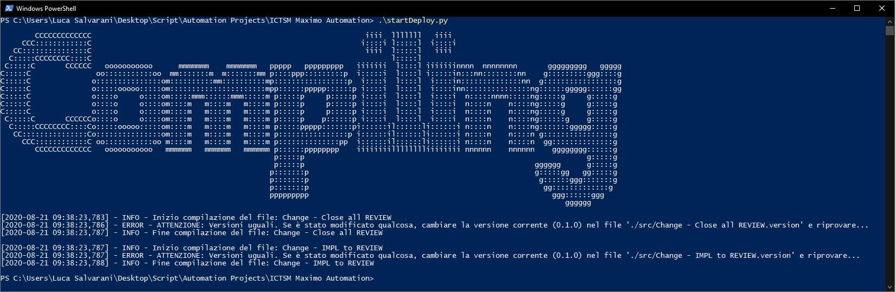

<p align="center">
	<h1 align="center">Maximo Automation for ICTSM Team</h1>
	<p align="center">
		<strong><i>- "Not your regular monkey" -</i></strong>
	</p>
</p>

## Elenco contenuti
- [Elenco contenuti](#elenco-contenuti)
- [Introduzione](#introduzione)
- [Elenco Automazioni](#elenco-automazioni)
	- [:zap: Chiusura change in REVIEW](#️-chiusura-change-in-review)
		- [Link](#link)
		- [Istruzioni per l'utilizzo](#istruzioni-per-lutilizzo)
	- [:zap: Portare change da IMPL/INPRG a REVIEW](#️-portare-change-da-implinprg-a-review)
		- [Link](#link-1)
		- [Istruzioni per l'utilizzo](#istruzioni-per-lutilizzo-1)
- [:book: Guide varie](#-guide-varie)
	- [Salvare le credenziali](#salvare-le-credenziali)
- [:hammer_and_wrench: Note per lo sviluppo](#-note-per-lo-sviluppo)
	- [Compilazione degli script](#compilazione-degli-script)
		- [Istruzioni](#istruzioni)

<br>

## Introduzione
Questo progetto mira all'**automatizzazione** di specifiche procedure del **Team ICTSM Trenitalia**, in modo da velocizzarne l'esecuzione.

Il core è formato da una [libreria in Python](https://github.com/LukeSavefrogs/maximo-gui-connector) di mia creazione e ogni script crea un file di log con lo stesso nome in cui vengono salvate informazioni utili.

Per utilizzare gli script è **OBBLIGATORIO** salvare nella **stessa cartella** un file chiamato `maximo_credentials.json` con al suo interno le **credenziali** di Maximo ([vedi](#salvare-le-credenziali))

<br>

## Elenco Automazioni
Di seguito un elenco delle automazioni disponibili al momento...

### :zap: Chiusura change in REVIEW
#### Link
- [**Download**](dist/Change%20-%20Close%20all%20REVIEW.exe)
- [Codice sorgente](src/Change%20-%20Close%20all%20REVIEW.py)

#### Istruzioni per l'utilizzo
1. Se non presente, [crea il file per le **credenziali**](#salvare-le-credenziali)
2. **Lancia lo script**

> ### Nota
> Lo script crea una log con vari dettagli al suo interno chiamata `{nome_script}.log`


### :zap: Portare change da IMPL/INPRG a REVIEW
#### Link
- [**Download**](dist/Change%20-%20IMPL%20to%20REVIEW.exe)
- [Codice sorgente](src/Change%20-%20IMPL%20to%20REVIEW.py)

#### Istruzioni per l'utilizzo
1. Se non presente, [crea il file per le **credenziali**](#salvare-le-credenziali)
2. **Crea un file** chiamato `changes.txt` e inserisci al suo interno tutti i change su linee diverse. Es.
	```
	CHXXXXXXX
	CHYYYYYYY

	CHZZZZZZZ
	# Questa riga è un commento e in quanto tale verrà saltato
	CHAAAAAAA

	# Puoi usare i commenti per qualsiasi cosa vuoi... Ad esempio chissà a chi applaudiva Battman? :confused:
	CHBBBBBBB
	CHCCCCCCC
	```
	> ### Keep calm :)
	> Le linee lasciate **vuote** o **precedute** da un <kbd>#</kbd> verranno **ignorate**
3. **Lancia lo script** e aspetta ;)

> ### Nota
> Lo script crea una log con vari dettagli al suo interno chiamata `{nome_script}.log`

<br>

## :book: Guide varie
### Salvare le credenziali
Il file di configurazione per le credenziali è fondamentale per l'utilizzo degli script di Maximo.

1. Crea un file chiamato `maximo_credentials.json` **nella stessa cartella** in cui hai salvato gli **script**. 
2. Incolla al suo interno il seguente testo:
	```json
	{
		"USERNAME": "IL TUO USERNAME",
		"PASSWORD": "LA TUA PASSOWRD"
	}
	```
3. Sostituisci `IL TUO USERNAME` e `LA TUA PASSOWRD` con i rispettivi dati

<br>

## :hammer_and_wrench: Note per lo sviluppo 
### Compilazione degli script
La **compilazione** è gestita da [uno script](./startDeploy.py) che ha il duplice scopo di **compilare** e **aggiornare** la **versione** degli script nei rispettivi file `.version`. I file `.version` sotto la cartella `src` vengono confrontati con quelli presenti nella cartella `dist`

#### Istruzioni
Usare lo script **`startDeploy.py`** passando come parametri i nomi dei file senza estensione:
```bash
python ./startDeploy.py 'Change - IMPL to REVIEW' 'Change - Close all REVIEW'
```

Se invece non vengono specificati dei file come parametri, verranno compilati di **default**:
- [Change - IMPL to REVIEW](./src/Change%20-%20IMPL%20to%20REVIEW.py)
- [Change - Close all REVIEW](./src/Change%20-%20Close%20all%20REVIEW.py)
  

